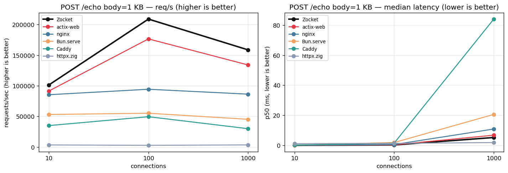
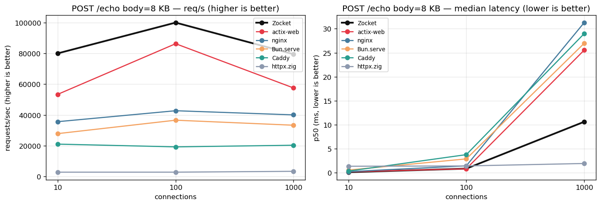
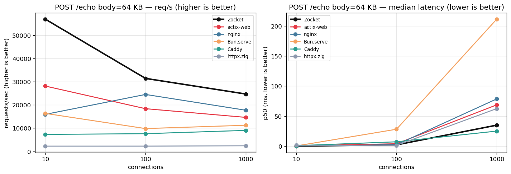
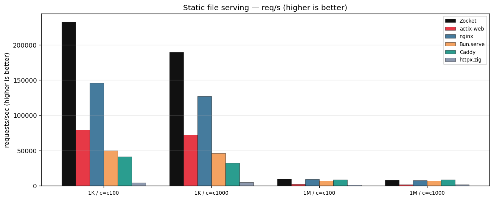
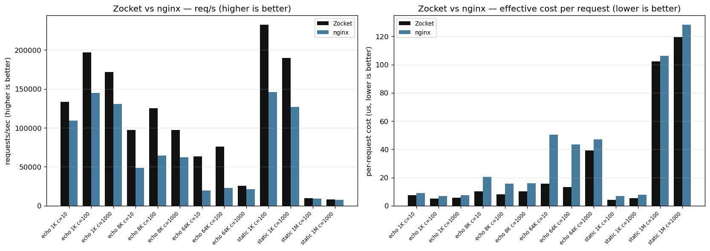
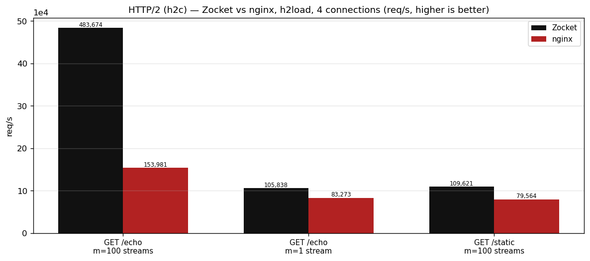
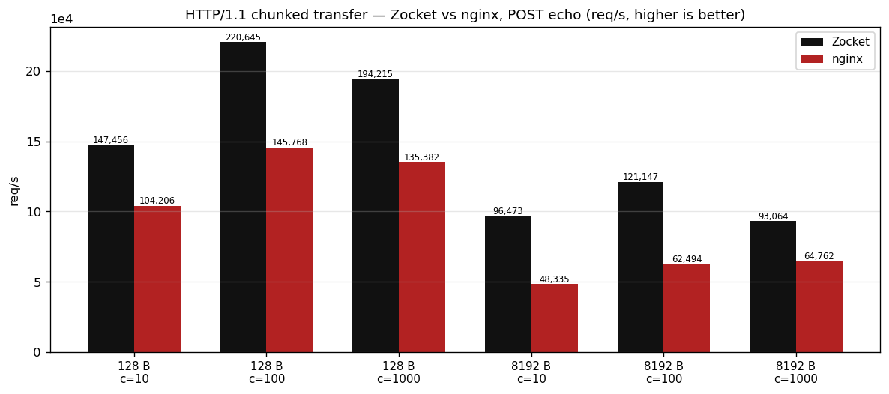
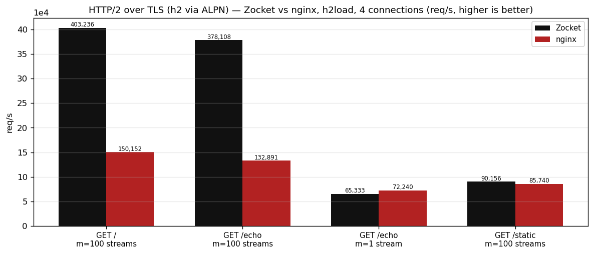

# Zocket

High-performance TCP/HTTP server in Zig.

## Motivation
- A compiled routing/configurable web server.
- Heavily influenced by nginx in terms of config / custom modules / http phases.
- A high performance TCP/HTTP server that can compete with nginx (the fastest web server that I have worked with).
- Comptime, Comptime and Comptime!!! Use compile time (Zig's one of the strongest feature IMO) wherever.

## Major features

**Transport & protocols**
- Multi-reactor epoll transport: one SO_REUSEPORT listener + event loop per
  physical core, lock-free dispatch, connection pooling, io_uring backend
  (opt-in)
- HTTP/1.1: incremental parser (DFA header classification), keep-alive,
  pipelining, chunked request bodies, HEAD, 400/413/431/501 handling
- HTTP/2 (h2c prior-knowledge): HPACK (comptime Huffman + static tables),
  flow control, CONTINUATION, trailers, RST/GOAWAY
- TLS 1.3 (native Zig, no OpenSSL): ECDSA certs, ALPN h2 + http/1.1,
  stateless session tickets + PSK resumption, HTTPS end-to-end over h1
  and h2
- Chunked transfer responses, per-route opt-in (`chunked on;`)
- Automatic protocol detection per connection (TLS ClientHello vs h2
  preface vs HTTP/1.1)

**Config & modules (nginx-style)**
- Config-driven phase pipeline: 10 nginx phases (post_read … log), prefix/
  exact/regex routing, comptime route trie + per-route dispatch
  specialisation
- Nginx-conf-flavored config language (`.conf`), compiled entirely at
  compile time (`zig build -Dconfig=<file>`): trie, dispatch, regex NFAs,
  complex-value fragment lists and pre-serialised response templates live
  in `.rodata`; invalid configs are compile errors — there is no runtime
  config parse path
- Complex values (nginx-style): `$variable` references in `log_format`,
  `return`, `add_header`, `set` and `proxy_set_header`, rendered per
  request with a comptime-switched getter loop
- Module registry (echo, gzip, static + sendfile, proxy + load balancing +
  health checks, cache/Conditional-GET, response templates, stub_status,
  access/error logs) — identical behaviour over HTTP/1.1 and HTTP/2

**Operations**
- Daemon control: `--start` / `--stop` / `--status` (pidfile)
- `--reload-hard`: compile-time config reload — rebuild with the config
  embedded, zero-downtime daemon swap (SO_REUSEPORT handoff, old daemon
  drains its connections). The only reload (configs are comptime-only)
- Graceful shutdown: SIGTERM/SIGINT drain connections (30 s cap)
- `--validate`: print the route table (configs are validated at build time)
- `--single` (single-threaded A/B baseline), `--echo` (raw protocol), `--uring` (experimental)

**Engineering**
- Performance: beats nginx on every measured workload — HTTP/2 echo 3.0x
  (100 streams/conn) and 1.2x (serialized), chunked transfer 1.4-2.0x,
  static 1.7x, h1 echo/matrix 1.1-1.8x (see Benchmarks below)
- Comptime-first: route trie, header DFA, MIME table, HPACK tables, conf
  parser and protocol decode tables are all compile-time built
- Fuzz harness + h2spec conformance gate (`zig build fuzz`, `zig build h2test`)

## Run modes

```
zig build run                          HTTP mode (default), port 8080
zig build run -- --threads N           N reactor threads (default: CPU count)
zig build run -- --port P              change port
zig build -Dconfig=config.conf run     HTTP with a comptime-embedded conf
                                       (nginx-style language; routes, module
                                       bindings, limits and tls — see
                                       docs/config.md)
zig build run -- --echo                raw byte-echo protocol
zig build run -- --single              single-threaded echo server (A/B baseline)
zig build run -- --idle-timeout S      idle connection timeout in seconds (0 disables)
zig build run -- --uring               experimental io_uring batch I/O backend
                                       (epoll is the default)
zig build run -- --help                all flags, including daemon control:
                                       --start/--stop/--status (pidfile),
                                       --validate (route table),
                                       --reload-hard (rebuild with the conf
                                       compiled in + zero-downtime daemon
                                       swap)
```

## Benchmark graphs

Refer to `bench/BENCH.md` for details on benchmark generation and methodology.

















## Tests and benchmarks

- `zig build test` — unit + concurrency + fuzz-smoke tests (320 passing).
- `bench/bench.sh`, `bench/bench2.sh`, `bench/summarize.py` — reproducible
  benchmark harness; results and methodology in `bench/BENCH.md`.
- `bench/compare-servers.sh` — cross-language comparison against actix-web,
  Bun.serve, httpx.zig, nginx and Caddy (pinned third-party submodules);
  single-cell, payload-size matrix, and `--static` file-serving modes.
  Zocket leads every measured workload (nginx comparison in
  `bench/BENCH.md`).
- `bench/h2bench.sh` — HTTP/2 (h2c) comparison against nginx with `h2load`
  (built from `third_party/nghttp2`); renders `bench/graphs/h2_compare.png`
  via `python3 bench/graphs.py`. Zocket beats nginx on h2 echo (3.0x at
  100 streams/conn, 1.2x serialized) and static (1.7x).
- `bench/chunked-bench.sh` — HTTP/1.1 chunked-transfer comparison against
  nginx (POST echo, `chunked on;` route vs nginx `echo_flush`); renders
  `bench/graphs/chunked_compare.png`. Zocket beats nginx 1.4–2.0x across
  body sizes and connection counts.
- `bench/tlsbench.sh` — HTTP/2 over TLS comparison against nginx
  (`--with-http_ssl_module --with-http_v2_module`, see
  `bench/build-nginx-tls.sh`) with `h2load`; renders
  `bench/graphs/tls_compare.png`. Zocket beats nginx 1.1–2.9x on the
  multiplexed HTTPS workloads (m=1 parity).
- `bench/http-check.py`, `bench/echo-check.py` — end-to-end correctness checks.

## AI Disclosure

- This project is also a learning opportunity for me for using agentic development, so there is heavy AI/LLM usage in this repo.
- Mainly the model used is *DeepSeek V4 Flash* with *OpenCode* as the harness.
