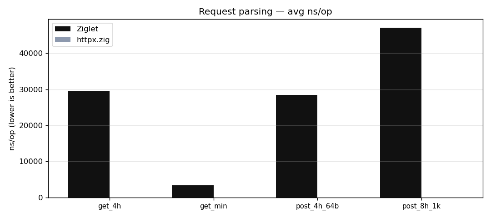
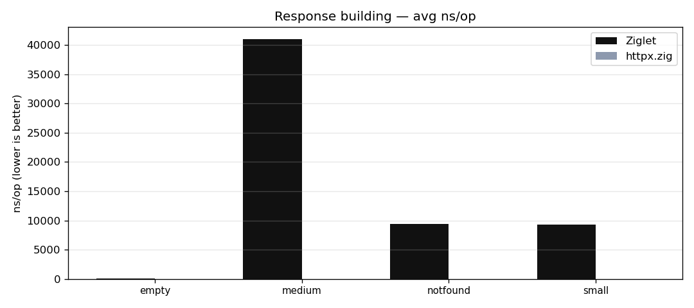

# Ziglet

High-performance TCP/HTTP server in Zig (0.16.0-dev, pinned in
`build.zig.zon`): multi-reactor epoll transport, HTTP/1.1, an nginx-style
config-driven phase pipeline, static file serving, reverse proxying, and
kernel-level optimizations (SO_REUSEPORT, sendfile, writev). In the
nginx-feature comparison it leads on every measured workload (see
`bench/BENCH.md`).

## Status

All milestones M1-M15 are complete (see `docs/milestones.md` for the
history). In the nginx/actix/Bun/Caddy/httpx comparison
(`bench/compare-servers.sh`) Ziglet leads every measured workload.
Roadmap: `docs/ROADMAP.md`. Configuration reference (routes + limits):
`docs/config.md`; full sample: `config.example.json`.

## Source layout

```
src/
  main.zig            CLI entry (flags only; all logic lives below)
  root.zig            library root; re-exports + comptime test imports
  embeds.zig          comptime embedded assets (@embedFile)
  ct_pool.zig         typed comptime arena for comptime builders (M15)
  net/                transport + lifecycle (M1/M2/M5/M13/M14/M15)
    server.zig        M1 single-threaded echo (A/B)
    multireactor.zig  reactor orchestration
    reactor.zig       per-core epoll thread (echo or HTTP mode)
    dispatcher.zig    lock-free round-robin (M2; removed by SO_REUSEPORT)
    timer_wheel.zig   idle-timeout timer wheel (M5)
    connection.zig    pooled connections with embedded 16 KiB buffers (M15)
    buffer.zig        growable byte buffer (memmove-safe)
    iouring.zig       io_uring batch I/O backend (opt-in, M15)
    epoll.zig         epoll wrapper (raw syscalls)
    eventfd.zig       wakeup primitive
    sockets.zig       raw socket syscall helpers
  http/               HTTP/1.1 layer (M3/M6/M8/M15)
    parser.zig        incremental request parser (DFA header classification)
    response.zig      response builder (Content-Length always set)
    arena.zig         request bump arena: embedded 16 KiB, zero allocs (M15)
    mime.zig          comptime MIME table (M6)
    header_dfa.zig    comptime DFA for header-name classification (M15)
  dsl/                config pipeline (M4/M7/M9-M12/M15)
    phase.zig         nginx-style phase enum
    router.zig        prefix/exact routing + comptime trie (M7)
    registry.zig      comptime module registry + Context
    pipeline.zig      phase dispatch loop
    static_cache.zig  nginx open_file_cache equivalent: fd + content cache (M15)
    modules/          echo, gzip, cache, access_log, error_log,
                      proxy, static, stub_status
  runtime/            config loading + server wiring (M4)
```

## Run modes

```
zig build run                          HTTP mode (default), port 8080
zig build run -- --threads N           N reactor threads (default: CPU count)
zig build run -- --port P              change port
zig build run -- --config <file>       HTTP with a JSON config (routes + module bindings;
                                       server limits like buffer/body/header caps live in
                                       the `limits` section - see docs/config.md)
zig build run -- --echo                raw byte-echo protocol (M1/M2 semantics)
zig build run -- --single              M1 single-threaded echo server (A/B)
zig build run -- --idle-timeout S      idle connection timeout in seconds (0 disables)
zig build run -- --uring               experimental io_uring batch I/O backend
                                       (epoll is the default)
```

## Benchmark graphs

Generated by `bench/graphs.py` from the stored raw results
(`bench/results/servers/`); regenerate with `python3 bench/graphs.py`.






## Tests and benchmarks

- `zig build test` — unit + concurrency tests (175 passing).
- `bench/bench.sh`, `bench/bench2.sh`, `bench/summarize.py` — reproducible
  benchmark harness; results and methodology in `bench/BENCH.md`.
- `bench/compare-servers.sh` — cross-language comparison against actix-web,
  Bun.serve, httpx.zig, nginx and Caddy (pinned third-party submodules);
  single-cell, payload-size matrix, and `--static` file-serving modes.
  Ziglet leads every measured workload (nginx comparison in
  `bench/BENCH.md`).
- `bench/http-check.py`, `bench/echo-check.py` — end-to-end correctness checks.
