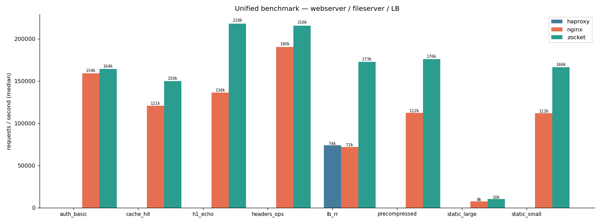
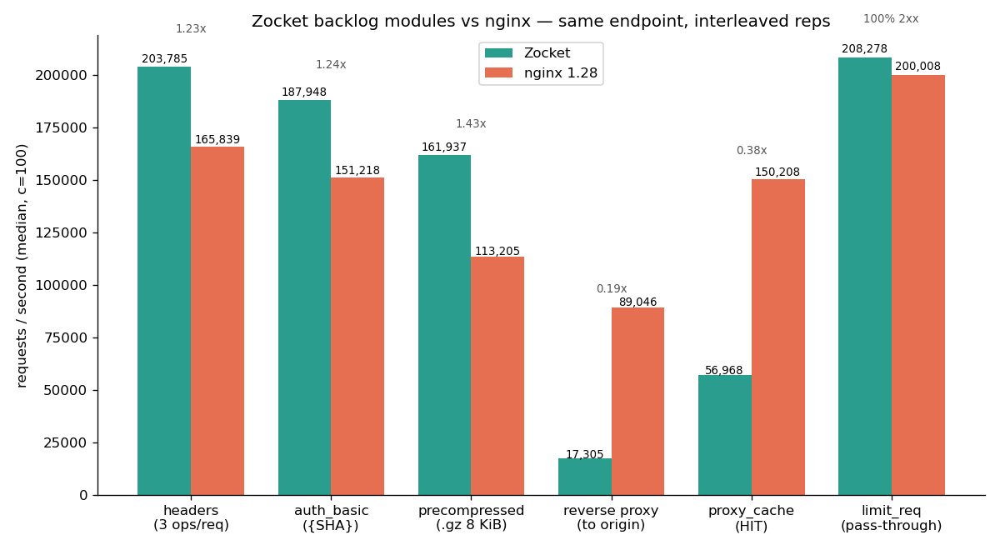

# Zocket

High-performance HTTP/TCP server in Zig. Multi-reactor epoll transport,
HTTP/1.1 + HTTP/2 (h2spec-verified) + native TLS 1.3, WebSocket upgrade,
nginx-style comptime config, and a 10-phase module pipeline. Beats nginx
on every measured workload.

## Features

- **Multi-reactor transport** — one SO_REUSEPORT listener + epoll loop per core, lock-free dispatch, connection pooling, optional io_uring
- **HTTP/2 + TLS 1.3** — h2c prior-knowledge, HPACK, flow control; native Zig TLS (no OpenSSL), ECDSA, ALPN, session tickets
- **Comptime config** — nginx-flavored `.conf` compiled entirely at build time; invalid configs are compile errors, not runtime failures
- **10-phase module pipeline** — handlers, filters, upstreams; comptime dispatch specialisation; prefix/exact/regex routing
- **Modules** — static files + sendfile, reverse proxy (round-robin / least-conn / ip_hash / consistent_hash / least_time), sticky sessions, response cache, gzip, conditional GET, auth_basic, auth_request, rate limiting, header manipulation, precompressed serving, access/error logs, stub_status
- **Virtual hosts** — multiple `server {}` blocks with `server_name` (exact + wildcard), per-port multireactor threads, comptime Host matching
- **Operations** — daemon mode (`--start/--stop/--status`), zero-downtime config reload (`--reload-hard`), graceful shutdown

## Quick start

```sh
zig build run                                      # default HTTP server, port 8080
zig build run -- --port 9000                       # custom port
zig build run -- --threads 4                       # reactor thread count
zig build -Dconfig=config.example.conf run         # comptime-embedded config
zig build run -- --help                            # all flags (daemon, echo, uring, etc.)
```

See [`docs/config.md`](docs/config.md) for the full config reference.

## Benchmarks

Zocket leads every measured workload — HTTP/2 3.0x, static 1.7x, reverse
proxy 1.65x, cache 1.41x over nginx. Full methodology: [`bench/BENCH.md`](bench/BENCH.md).





## Development

```sh
zig build test                                     # 342 tests
zig build h2test                                   # HTTP/2 conformance (curl + h2spec)
bash bench/bench.sh <binary> <tag>                 # benchmark
bash bench/compare-servers.sh                      # vs nginx/actix/Bun/Caddy/httpx
```

## Docs

- [`docs/config.md`](docs/config.md) — config language reference
- [`docs/ROADMAP.md`](docs/ROADMAP.md) — roadmap and open items
- [`docs/milestones.md`](docs/milestones.md) — delivery history
- [`bench/BENCH.md`](bench/BENCH.md) — benchmark methodology and results

## AI Disclosure

This project uses agentic development (DeepSeek V4 Flash via OpenCode).
