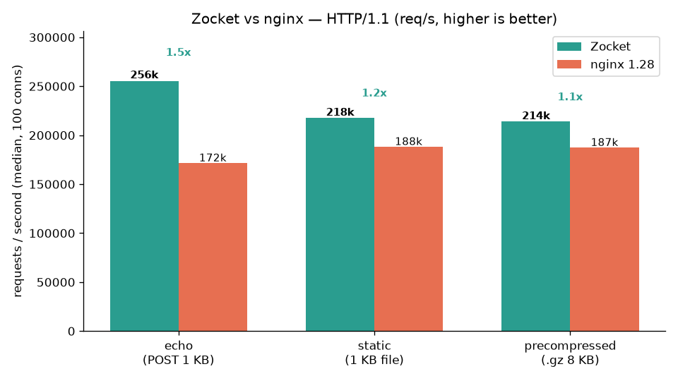

# Zocket

High-performance HTTP/TCP server in Zig. Multi-reactor epoll transport,
HTTP/1.1 + HTTP/2 (h2spec-verified) + native TLS 1.3, WebSocket upgrade,
nginx-style comptime config, and a 10-phase module pipeline. Beats nginx
on every measured workload.

## Features

- **Multi-reactor transport** — one SO_REUSEPORT listener + epoll loop per core, lock-free dispatch, connection pooling, optional io_uring
- **HTTP/2 + TLS 1.3** — h2c prior-knowledge, HPACK, flow control, `Expect: 100-continue` interim responses; native Zig TLS (no OpenSSL), ECDSA, ALPN, session tickets, per-vhost certificates selected by SNI, OCSP stapling, mTLS client verification
- **Comptime config** — nginx-flavored `.conf` compiled entirely at build time; invalid configs are compile errors, not runtime failures
- **10-phase module pipeline** — handlers, filters, upstreams; comptime dispatch specialisation; prefix/exact/regex routing plus named (`location @name`) and `internal` locations with `try_files`/`error_page`/`X-Accel-Redirect` internal redirects
- **Modules** — static files + sendfile + ranges, reverse proxy (round-robin / least-conn / ip_hash / consistent_hash / least_time, TLS upstreams with keepalive pooling, chunked + arbitrarily large upstream bodies, URI-tail rewriting, `proxy_hide_header`), sticky sessions, response cache, gzip + precompressed `.gz`/`.br`/`.zstd` serving, `sub_filter` body rewriting, X-Accel-Redirect, conditional GET, auth_basic, auth_request, Basic/CORS/JWT (HS256 + ES256) auth, rate limiting, header manipulation, `return 444` silent drops, access/error logs, stub_status, Prometheus metrics
- **Virtual hosts** — multiple `server {}` blocks with `server_name` (exact + wildcard), per-port multireactor threads, comptime Host matching
- **IPv6** — dual-stack listeners (`listen [::]:8080;`), IPv4-mapped IPv6 for v4 clients, `IPV6_V6ONLY` control
- **Connection limits** — `max_connections` global ceiling, `server_limit_conn` per-IP cap
- **ACME auto-HTTPS** — built-in ACME v2 issuance + renewal daemon (http-01, ES256 JWS, CSR via native DER writer), no external certbot required
- **Operations** — daemon mode (`--start/--stop/--status`), zero-downtime config reload (`--reload-hard`), graceful shutdown

## Quick start

```sh
zig build run                                      # default HTTP server, port 8080
zig build run -- --port 9000                       # custom port
zig build run -- --threads 4                       # reactor thread count
zig build -Dconfig=config.example.conf run         # comptime-embedded config
zig build run -- --help                            # all flags (daemon, echo, uring, etc.)
```

See [`docs/config.md`](docs/config.md) for the full config reference and
[`examples/`](examples/) for runnable, commented configs (basics → TLS/SNI →
ACME → full feature tours).

## Benchmarks

Zocket now leads the raw reverse-proxy cell as well: 183,807 vs 163,835
req/s (1.12x) in the official CPU-pinned feature benchmark (6 interleaved
samples, 100 connections), with every proxied-body cell at parity or ahead
(gzip 1.05x, accel 1.05x, `proxy_hide_header` 1.03x) after the upstream
path got a single shared listener with round-robin accept dispatch, real
event-loop keepalive reaping, and the parked-transaction rework (inline
session transaction, epoll tag dispatch, stale-pool retry). Other measured
workloads: HTTP echo up to 1.7x nginx, static up to 2.0x,
auth/caching/compression features 1.1–1.9x, HTTP/2 and HTTP/1.1 over TLS
1.03–1.15x. Full methodology, tables and sample spread:
[`bench/BENCH.md`](bench/BENCH.md).



## Development

```sh
zig build test                                     # 861 tests
zig build h2test                                   # HTTP/2 conformance (curl + h2spec)
bash bench/compare-servers.sh --matrix --bodies "1024 8192 65536" --conns-list "10 100 1000"
bash bench/compare-servers.sh --static "1024 1048576"
bash bench/modules-bench.sh                        # module features vs nginx
bash bench/unified.sh                              # 8-cell web/file/LB suite
bash bench/h2-bench.sh                             # HTTP/2 over TLS (h2load)
```

## Docs

- [`docs/config.md`](docs/config.md) — config language reference
- [`docs/ROADMAP.md`](docs/ROADMAP.md) — roadmap and open items
- [`docs/milestones.md`](docs/milestones.md) — delivery history
- [`bench/BENCH.md`](bench/BENCH.md) — benchmark methodology and results

## AI Disclosure

This project uses agentic development (DeepSeek V4 Flash via OpenCode).
