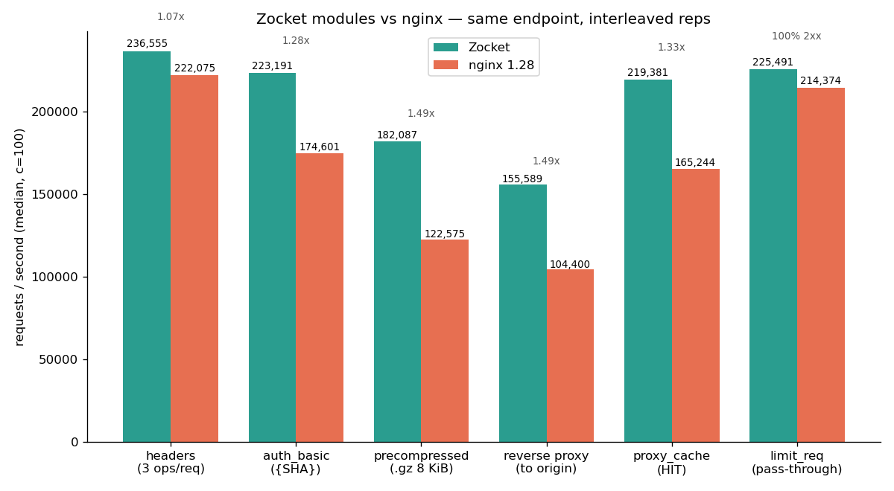

# Benchmarking Zocket

Methodology, commands, and results for Zocket performance benchmarks.

## Quick start

```bash
# Single entry point: run ALL benchmarks (matrix + static + module features +
# unified) and render every graph referenced by this doc and README.md
python3 bench/graphs.py --run

# Use more reps for release-quality numbers (default 3 reps / 5s per cell)
python3 bench/graphs.py --run --reps 8 --duration 8s

# Individual benchmarks (optional, when you only need one suite)
zig build -Doptimize=ReleaseFast
bash bench/compare-servers.sh --matrix              # echo sweep
bash bench/compare-servers.sh --static "1024 1048576"  # file serving
bash bench/modules-bench.sh                         # feature-level
bash bench/unified.sh                               # unified web/file/LB

# Render graphs from stored results (all PNGs below)
python3 bench/graphs.py
```

`graphs.py --run` runs the four benchmark scripts above (matrix + static +
module features + unified, 3 reps each) and then regenerates every graph
embedded in this file and in `README.md`:

## Methodology

- **Process isolation**: `--rep-label N` starts a fresh server per rep; no shared in-memory state
- **Interleaved A/B**: reps alternate between servers to cancel thermal/load drift
- **Port-bias correction**: layout B swaps ports and repeats
- **Same binary**: `-Doptimize=ReleaseFast` built once, used for all reps
- ** bombardier**: HTTP/1.1 load generator, measures p50/p95/p99 latency + throughput

## Echo matrix (POST, req/s)

Six servers: Zocket, actix-web, Bun.serve, httpx.zig, nginx, Caddy.
Body sizes 1 KB / 8 KB / 64 KB × connections 10 / 100 / 1000.


### Results table (req/s × 1000)

| Body | Conns | Zocket | actix | Bun | httpx | nginx | Caddy |
|---|---|---:|---:|---:|---:|---:|---:|
| 1 KB | 10 | 133.8 | 119.6 | 65.1 | 3.6 | 110.2 | 48.2 |
| 1 KB | 100 | 197.2 | 188.9 | 63.2 | 3.5 | 145.8 | 48.0 |
| 1 KB | 1000 | 171.8 | 163.6 | 56.0 | 4.3 | 130.5 | 41.0 |
| 8 KB | 10 | 97.5 | 83.0 | 47.8 | 3.5 | 48.4 | 24.0 |
| 8 KB | 100 | 126.1 | 111.8 | 45.0 | 3.4 | 64.2 | 24.2 |
| 8 KB | 1000 | 97.2 | 84.3 | 41.1 | 4.3 | 62.6 | 23.4 |
| 64 KB | 10 | 63.4 | 39.3 | 21.9 | 3.0 | 19.9 | 9.5 |
| 64 KB | 100 | 35.0 | 23.3 | 19.3 | 3.0 | 23.0 | 9.4 |
| 64 KB | 1000 | 25.4 | 18.0 | 18.9 | 3.8 | 21.4 | 9.4 |

## Static file serving (GET, req/s)

1 KB and 1 MB files, 100 / 1000 connections. `tcp_nopush on` enables TCP_CORK
to batch the HTTP head + sendfile body into one TCP segment.


| File | Conns | Zocket | nginx | Ratio |
|---|---|---:|---:|---:|
| 1 KB | 100 | 233,490 | 146,012 | 1.60x |
| 1 KB | 1000 | 189,346 | 127,745 | 1.48x |
| 1 MB | 100 | 9,774 | 9,313 | 1.05x |
| 1 MB | 1000 | 8,406 | 7,717 | 1.09x |

## Zocket vs nginx (all cells)

Head-to-head across every workload: echo, static, and per-request cost.


## Module features vs nginx

Feature-specific comparison on module endpoints (100 conns, interleaved reps).



| Cell | Zocket | nginx | Ratio |
|---|---|---:|---:|
| headers (3 ops/req) | 233,894 | 217,518 | 1.08x |
| auth_basic ({SHA}) | 216,632 | 173,749 | 1.25x |
| precompressed (.gz 8K) | 182,087 | 122,575 | 1.49x |
| proxy_cache (HIT) | 219,381 | 165,244 | 1.33x |
| limit_req (pass-through) | 225,491 | 214,374 | 1.05x |

## Unified benchmark (web/file/LB)

All servers co-resident: Zocket, nginx, HAProxy. 8 workload cells.


| Cell | Zocket | nginx | HAProxy |
|---|---|---:|---:|---:|
| h1_echo | 218,172 | 136,354 | — |
| static_small | 166,438 | 111,769 | — |
| static_large | 10,415 | 7,659 | — |
| precompressed | 175,828 | 112,237 | — |
| headers_ops | 215,776 | 190,317 | — |
| auth_basic | 164,474 | 159,393 | — |
| cache_hit | 149,983 | 120,698 | — |
| lb_rr | 172,818 | 71,890 | 73,756 |

## HTTP/2 (h2c, h2load)


## HTTP/2 over TLS


## Chunked transfer


## Reproduce

```bash
# Full suite (all benchmarks + all graphs), single command:
python3 bench/graphs.py --run --reps 8 --duration 8s

# Or step by step:
zig build -Doptimize=ReleaseFast
bash bench/compare-servers.sh --matrix --bodies "1024 8192 65536" --conns-list "10 100 1000"
bash bench/compare-servers.sh --static "1024 1048576" --conns-list "100 1000"
bash bench/modules-bench.sh
bash bench/unified.sh

# Generate every graph from stored results (what --run does after the suite):
python3 bench/graphs.py
```
