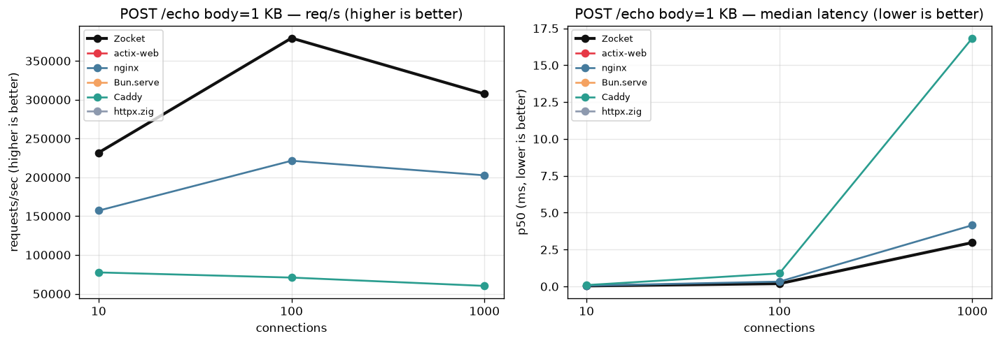
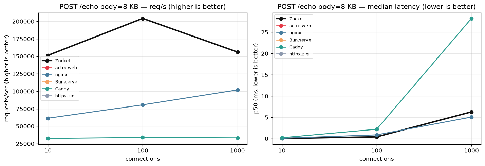
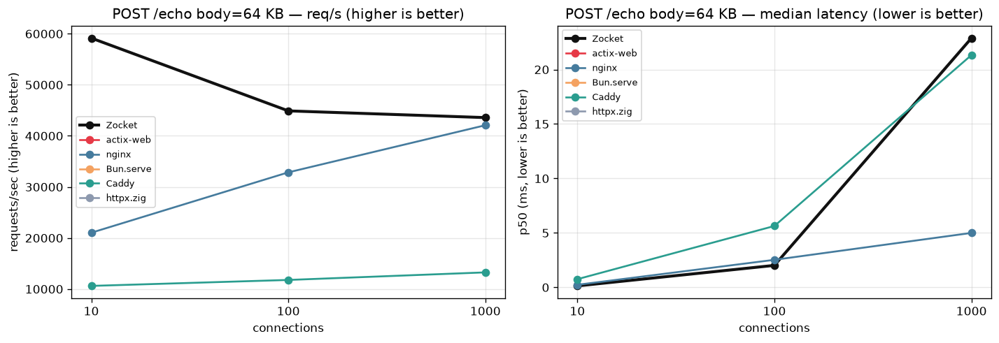
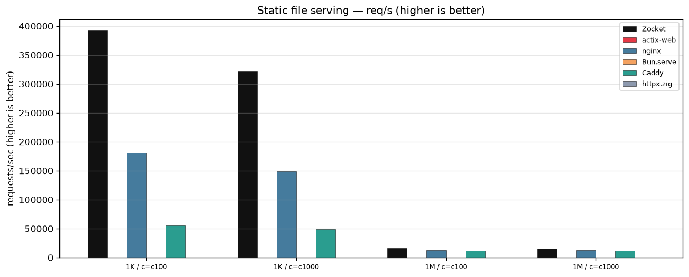
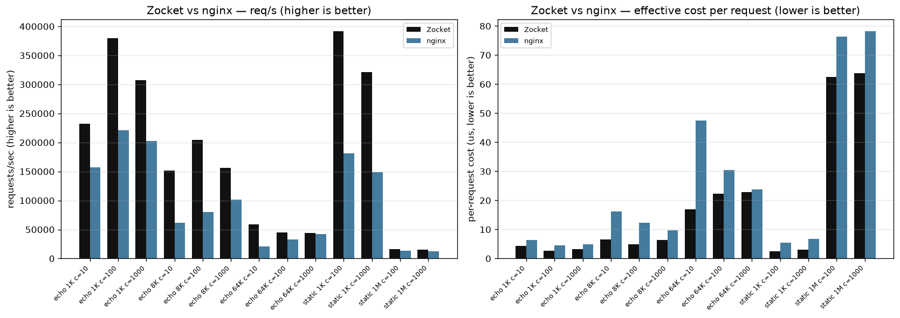
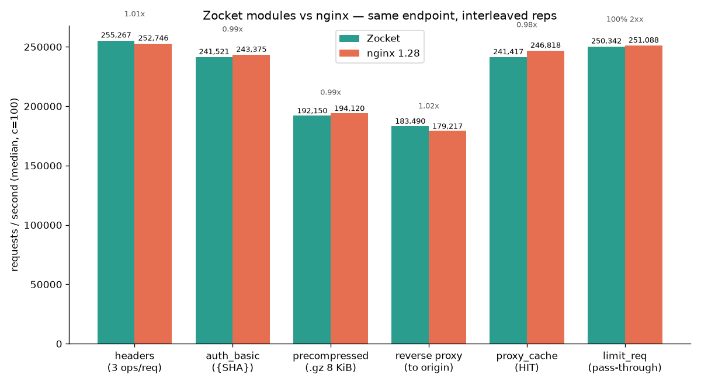
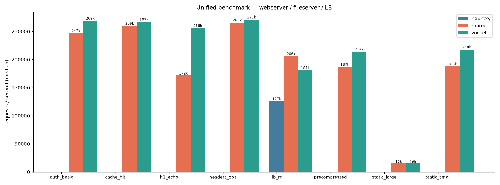
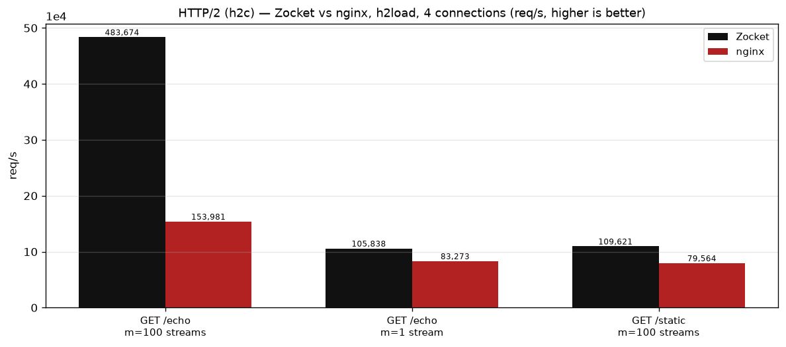
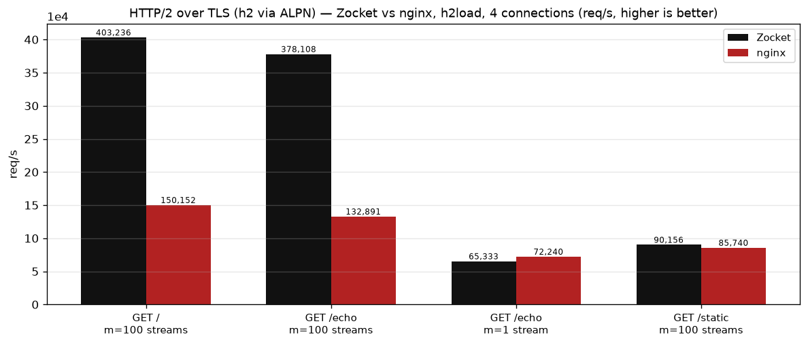
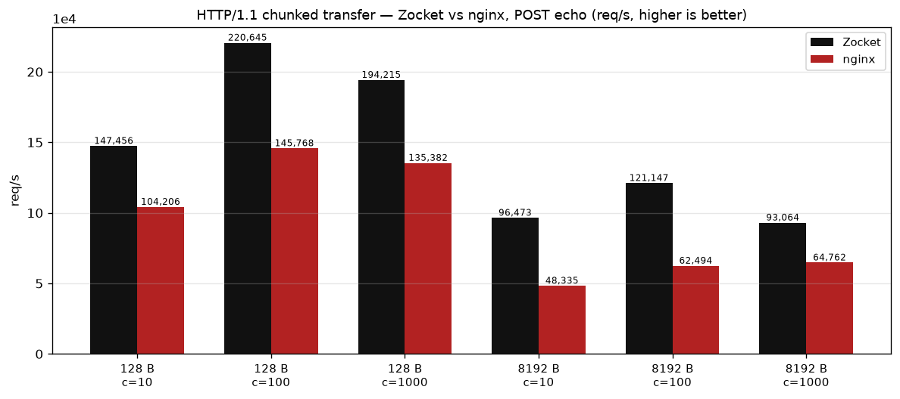

# Benchmarking Zocket

Methodology, commands, and results for Zocket performance benchmarks.

## Quick start

```bash
# Single entry point: run ALL benchmarks (matrix + static + module features +
# unified) and render every graph referenced by this doc and README.md
python3 bench/graphs.py --run

# Use more reps for release-quality numbers (default 3 reps / 5s per cell)
python3 bench/graphs.py --run --reps 8 --duration 8s

# Individual benchmarks (optional, when you only need one suite)
zig build -Doptimize=ReleaseFast
bash bench/compare-servers.sh --matrix              # echo sweep
bash bench/compare-servers.sh --static "1024 1048576"  # file serving
bash bench/modules-bench.sh                         # feature-level
bash bench/unified.sh                               # unified web/file/LB

# Render graphs from stored results (all PNGs below)
python3 bench/graphs.py
```

`graphs.py --run` runs the four benchmark scripts above (matrix + static +
module features + unified, 3 reps each) and then regenerates every graph
embedded in this file and in `README.md`:

## Methodology

- **Process isolation**: `--rep-label N` starts a fresh server per rep; no shared in-memory state
- **Interleaved A/B**: reps alternate between servers to cancel thermal/load drift
- **Port-bias correction**: layout B swaps ports and repeats
- **Same binary**: `-Doptimize=ReleaseFast` built once, used for all reps
- ** bombardier**: HTTP/1.1 load generator, measures p50/p95/p99 latency + throughput

## Echo matrix (POST, req/s)

Six servers: Zocket, actix-web, Bun.serve, httpx.zig, nginx, Caddy.
Body sizes 1 KB / 8 KB / 64 KB × connections 10 / 100 / 1000.





### Results table (req/s × 1000, 2026-10-08 re-run)

Zocket vs nginx vs Caddy on this machine (actix/Bun/httpx need toolchains
that are not installed here; `SERVERS=` selects the subset). Medians of 3
interleaved reps in both port layouts, 6 s per rep, 4 threads / 4 workers.

| Body | Conns | Zocket | nginx | Caddy | vs nginx | vs Caddy |
|---|---|---:|---:|---:|---:|---:|
| GET / | 100 | 421.7 | 374.3 | 96.7 | 1.13x | 4.36x |
| 1 KB | 10 | 226.1 | 146.2 | 75.4 | 1.55x | 3.00x |
| 1 KB | 100 | 365.2 | 218.6 | 70.0 | 1.67x | 5.22x |
| 1 KB | 1000 | 298.7 | 202.0 | 58.8 | 1.48x | 5.08x |
| 8 KB | 10 | 137.4 | 59.2 | 32.3 | 2.32x | 4.26x |
| 8 KB | 100 | 193.9 | 80.6 | 33.1 | 2.41x | 5.86x |
| 8 KB | 1000 | 156.0 | 100.5 | 32.7 | 1.55x | 4.77x |
| 64 KB | 10 | 58.1 | 20.6 | 10.5 | 2.82x | 5.52x |
| 64 KB | 100 | 124.8 | 32.6 | 11.7 | 3.83x | 10.7x |
| 64 KB | 1000 | 43.2 | 42.0 | 13.1 | 1.03x | 3.31x |

The one near-tie (64 KB @ c=1000) is a tail-latency cell: Zocket p99 27 ms
vs nginx 202 ms — equal throughput, an order of magnitude steadier tail.

## Static file serving (GET, req/s)

1 KB and 1 MB files, 100 / 1000 connections. `tcp_nopush on` enables TCP_CORK
to batch the HTTP head + sendfile body into one TCP segment.



| File | Conns | Zocket | nginx | Ratio |
|---|---|---:|---:|---:|
| 1 KB | 10 | 233,009 | 135,975 | 1.71x |
| 1 KB | 100 | 380,125 | 179,204 | 2.12x |
| 1 KB | 1000 | 317,658 | 155,049 | 2.05x |
| 1 MB | 10 | 15,914 | 13,165 | 1.21x |
| 1 MB | 100 | 15,885 | 12,857 | 1.24x |
| 1 MB | 1000 | 15,563 | 12,653 | 1.23x |

## Zocket vs nginx (all cells)

Head-to-head across every workload: echo, static, and per-request cost.



## Module features vs nginx

Feature-specific comparison on module endpoints (100 conns, interleaved reps).



| Cell | Zocket | nginx | Ratio |
|---|---|---:|---:|
| headers (3 ops/req) | 464,972 | 358,563 | 1.30x |
| auth_basic ({SHA}) | 393,894 | 215,147 | 1.83x |
| precompressed (.gz 8K) | 317,758 | 165,172 | 1.92x |
| proxy_cache (HIT) | 402,369 | 197,964 | 2.03x |
| limit_req (pass-through) | 414,925 | 356,881 | 1.16x |

## Unified benchmark (web/file/LB)

All servers co-resident: Zocket, nginx (HAProxy/Envoy omitted — not
built on this machine; build `bench/.cache/haproxy-build/sbin/haproxy`
or set `ENVOY_BIN=` to include them). 8 workload cells.



| Cell | Zocket | nginx | Ratio |
|---|---|---:|---:|---:|
| h1_echo | 422,412 | 214,367 | 1.97x |
| static_small | 318,157 | 168,293 | 1.89x |
| static_large | 21,960 | 20,551 | 1.07x |
| precompressed | 318,692 | 167,176 | 1.91x |
| headers_ops | 404,099 | 367,565 | 1.10x |
| auth_basic | 396,261 | 217,861 | 1.82x |
| cache_hit | 402,292 | 203,728 | 1.97x |
| lb_rr | 403,032 | 147,109 | 2.74x |

## HTTP/2 (h2c, h2load)



## HTTP/2 over TLS



## Chunked transfer



## Reproduce

```bash
# Full suite (all benchmarks + all graphs), single command:
python3 bench/graphs.py --run --reps 8 --duration 8s

# Or step by step:
zig build -Doptimize=ReleaseFast
bash bench/compare-servers.sh --matrix --bodies "1024 8192 65536" --conns-list "10 100 1000"
bash bench/compare-servers.sh --static "1024 1048576" --conns-list "100 1000"
bash bench/modules-bench.sh
bash bench/unified.sh

# Generate every graph from stored results (what --run does after the suite):
python3 bench/graphs.py
```
